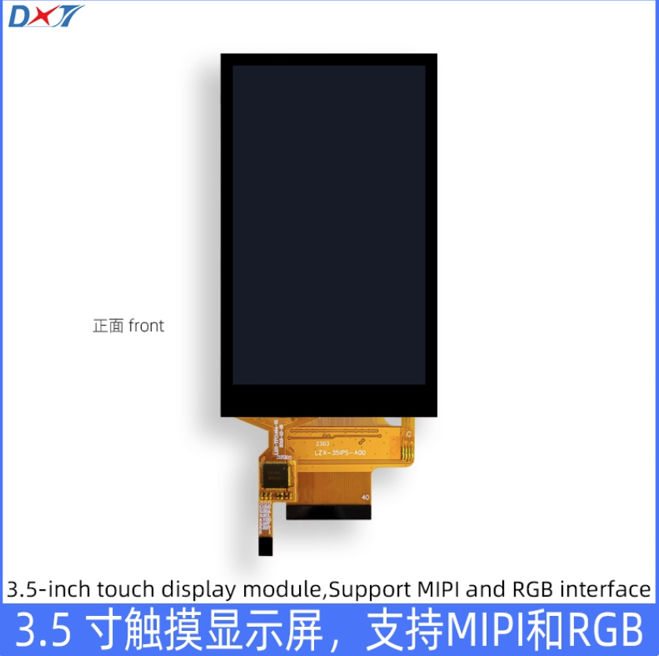
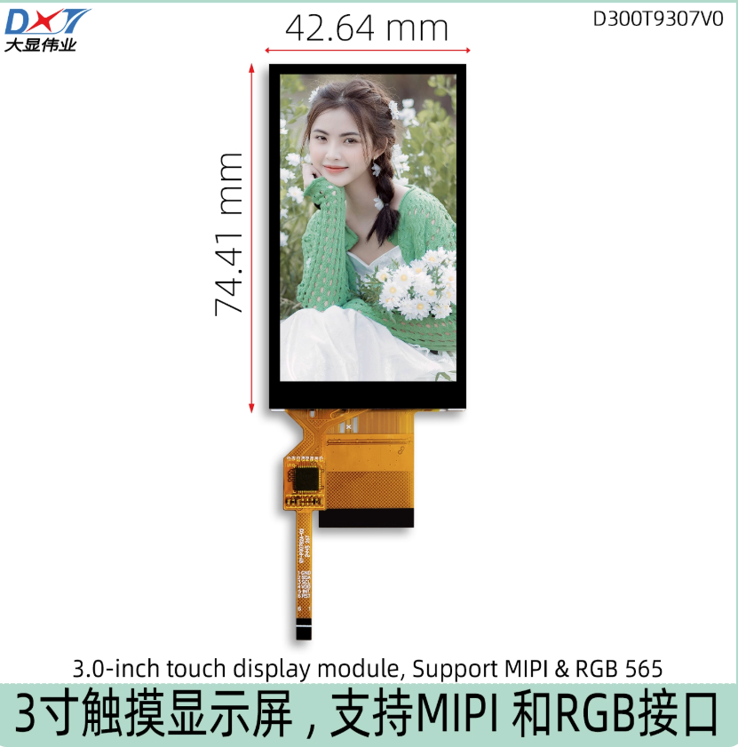
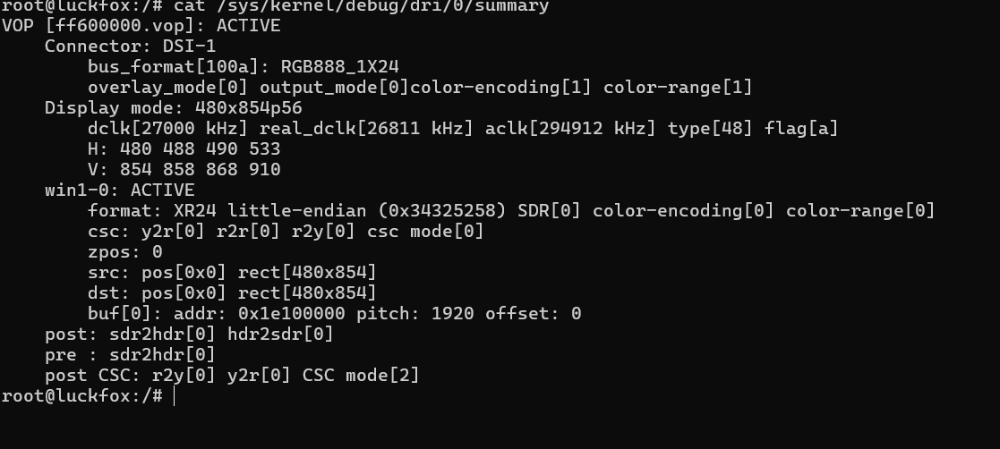
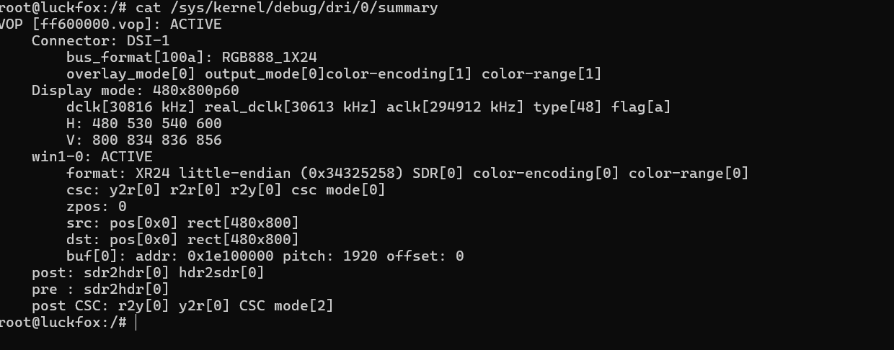
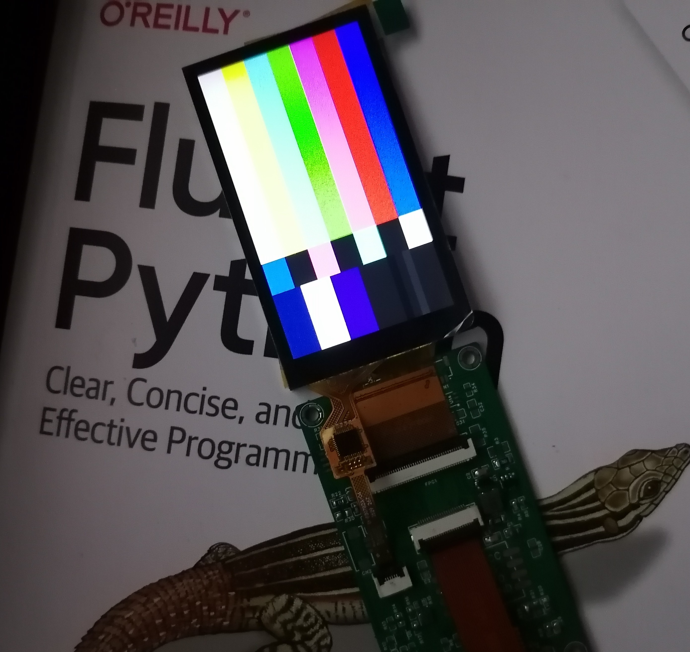
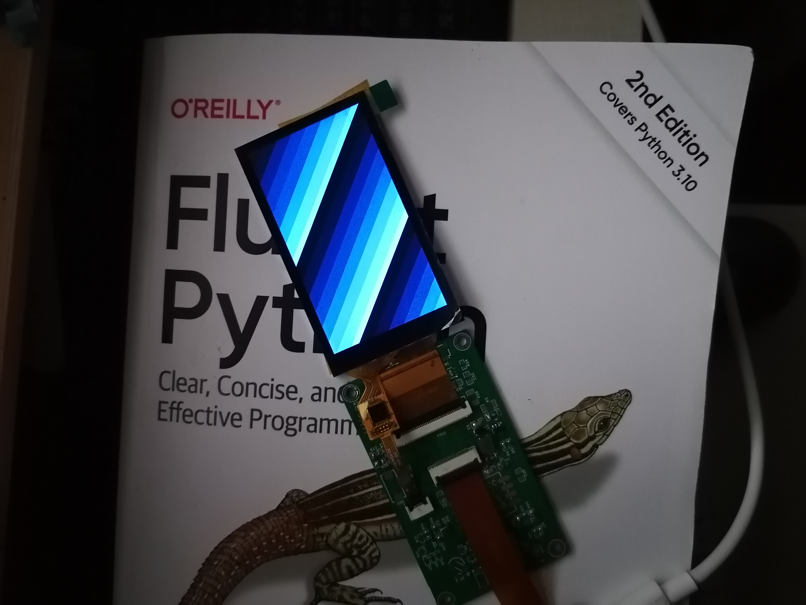
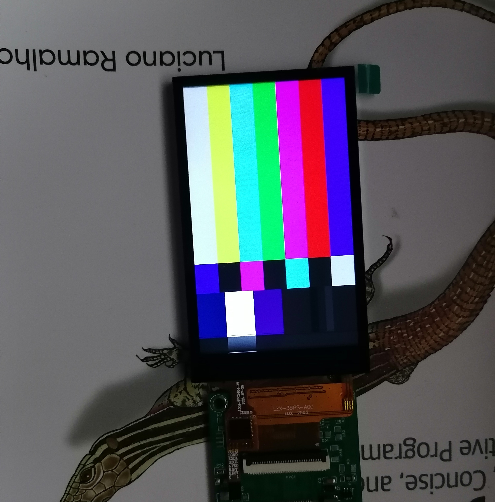
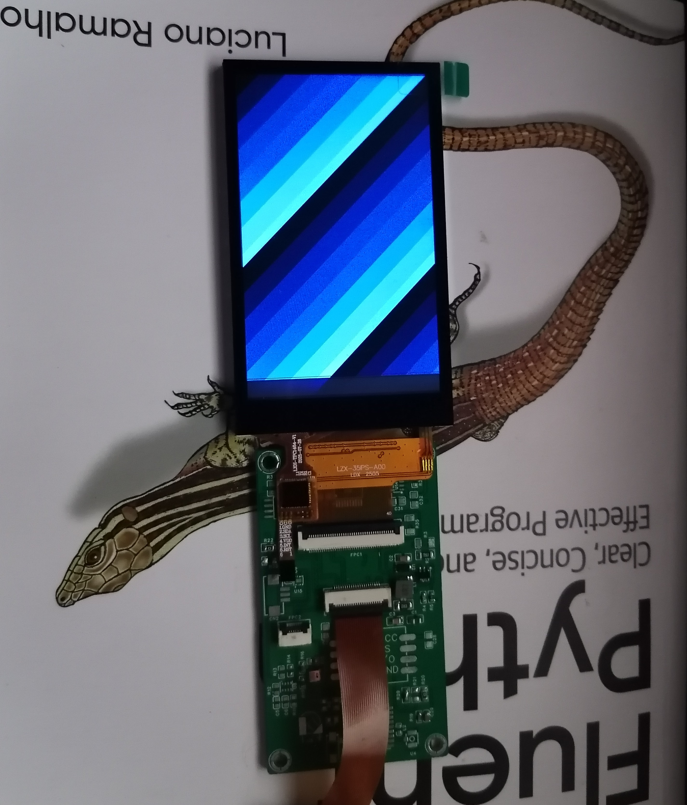

RK3506适配大显3.0/3.5英寸LCD显示屏


## 概述

为基于RK3506的开发板适配了两款MIPI DSI触摸屏：

- 3.5英寸触摸屏，型号：D350T1013V1。



- 3.0英寸触摸屏，型号：D300T9307V0。

  


这两款屏幕均为MIPI 2-lane接口，且具有相同的线序，目前两款屏幕的显示及触摸部分均已进行适配。

显示部分的适配，主要包括屏参和屏幕上下电序列的设置。触摸部分的适配，经与厂商沟通，这两块屏幕的触摸屏驱动通用`ft5x06`，因为这个驱动运用非常广泛，基本上内核都会自带该驱动，因此基本上不涉及驱动代码的编写或移植，只需要确保编译内核时启用了该驱动（`TOUCHSCREEN_EDT_FT5X06=y`），并在设备树中按照触摸屏对应参数，如尺寸、中断引脚、坐标方向等，对其进行了正确配置即可。


## 参考设计与代码

此次，我使用`luckfox lyra zero w `开发板进行了测试，此项目包含适用于`luckfox lyra zero w`的软硬件参考设计。


### 屏幕转接板参考设计

#### 参考原理图


#### 参考PCB设计

pcb工程文件：`hardware/ProPrj_LuckfoxLyraLCD_2025-09-14.epro`


### 设备树配置源代码

#### 3.0英寸屏幕设备树配置

参见：`software/sdk/kernel-6.1/arch/arm/boot/dts/rk3506-luckfox-lyra-dsi-d300t9307v0.dtsi`

```c
/*
* 适用于大显3.0英寸显示屏的设备树配置
* 型号：D300T9307V0
* 分辨率：480 * 854（RGB点阵屏）
* 接口：MIPI DSI（2-lane）
* 驱动：st7701s
* 触摸：有
* 触摸i2c：ft5x06（兼容）
*
* created by: zimolab(https://github.com/zimolab)
* created at: 2025-9-14
*/
/dts-v1/;

#include "rk3506-luckfox-lyra-ultra.dtsi"


// // 背光配置
&backlight{
	status = "okay";
};

// MIPI DSI配置
&dsi {
	status = "okay";
};

&dsi_panel {
	status = "okay";
	compatible = "simple-panel-dsi";
	reg = <0>;
	backlight = <&backlight>;
	
	prepare-delay-ms = <120>;
	reset-delay-ms = <120>;
	init-delay-ms = <120>;
	disable-delay-ms = <120>;
	unprepare-delay-ms = <120>;
	
	dsi,flags = <(MIPI_DSI_MODE_VIDEO | MIPI_DSI_MODE_VIDEO_BURST | MIPI_DSI_MODE_LPM | MIPI_DSI_MODE_NO_EOT_PACKET )>;
	dsi,format = <MIPI_DSI_FMT_RGB888>;
	dsi,lanes  = <2>;
	
	// mipi初始化序列
	panel-init-sequence = [
	39 00 06 FF 77 01 00 00 13
	15 00 02 EF 08
	39 00 06 FF 77 01 00 00 10
	39 00 03 C0 E9 03
	39 00 03 C1 0F 0C
	39 00 03 C2 27 0A
	15 00 02 CC 10
	39 00 11 B0 00 23 2A 0A 0E 03 12 06 06 2A 00 10 0F 2D 34 1F
	39 00 11 B1 00 24 2B 0F 12 07 15 0A 0A 2B 08 13 10 2D 33 1F
	39 00 06 FF 77 01 00 00 11
	15 00 02 B0 5D
	15 00 02 B1 74
	15 00 02 B2 84
	15 00 02 B3 80
	15 00 02 B5 45
	15 00 02 B7 85
	15 00 02 B8 33
	15 00 02 C1 78
	15 00 02 C2 78
	15 64 02 D0 88
	39 00 04 E0 00 00 02
	39 00 0C E1 06 A0 08 A0 05 A0 07 A0 00 44 44
	39 00 0D E2 30 30 44 44 6E A0 00 00 6E A0 00 00
	39 00 05 E3 00 00 33 33
	39 00 03 E4 44 44
	39 00 11 E5 0D 69 0A A0 0F 6B 0A A0 09 65 0A A0 0B 67 0A A0
	39 00 05 E6 00 00 33 33
	39 00 03 E7 44 44
	39 00 11 E8 0C 68 0A A0 0E 6A 0A A0 08 64 0A A0 0A 66 0A A0
	39 00 03 E9 36 00
	39 00 08 EB 00 01 E4 E4 44 88 40
	39 00 11 ED FF 45 67 FA 01 2B CF FF FF FC B2 10 AF 76 54 FF
	39 00 07 EF 10 0D 04 08 3F 1F
	39 00 06 FF 77 01 00 00 00
	15 00 02 36 00
	15 00 02 3A 77
	05 78 01 11
	05 14 01 29
	];
	
	// 面板退出序列
	panel-exit-sequence = [
	05 00 01 28
	05 00 01 10
	];
	
};

&disp_timings0 {
	native-mode = <&dsi_timing_d300t9307v0>;
	
	dsi_timing_d300t9307v0: dsi_timing_d300t9307v0 {
		clock-frequency = <27000000>;// 时钟频率
		hactive = <480>;// 水平像素
		vactive = <854>;// 垂直像素
		hfront-porch = <8>;// 水平前廊
		hsync-len = <2>;// 水平同步长度
		hback-porch = <43>;// 水平后廊
		vfront-porch = <4>;// 垂直前廊
		vsync-len = <10>;// 垂直同步长度
		vback-porch = <42>;// 垂直后廊
		hsync-active = <0>;// 水平同步极性激活
		vsync-active = <0>;// 垂直同步极性激活
		de-active = <0>;// 数据使能极性激活
		pixelclk-active = <1>;// 像素时钟极性激活
	};
};

&i2c2{
	status = "okay";
};


/*
* 触摸IC所在I2C总线：I2C2
* 触摸IC地址：0x38
* 触摸IC兼容驱动：edt-ft5506
* 触摸IC中断引脚：GPIO1_C4
*/
&ft5406{
	status = "okay";
	compatible = "edt,edt-ft5506";
	reg = <0x38>;
	
	/delete-property/ touchscreen-inverted-x;
	/delete-property/ touchscreen-inverted-y;
	/delete-property/ touchscreen-swapped-x-y;
	touchscreen-inverted-x;
	
	
	touchscreen-size-x = <480>;
	touchscreen-size-y = <854>;
	
	touch-gpio = <&gpio1 RK_PC4 IRQ_TYPE_EDGE_RISING>;
	interrupt-parent = <&gpio1>;
	interrupts = <RK_PC4 IRQ_TYPE_LEVEL_LOW>;
	
};
```


#### 3.5英寸屏幕设备树配置

参见：`software/sdk/kernel-6.1/arch/arm/boot/dts/rk3506-luckfox-lyra-dsi-d350t1013v1.dtsi`

```c
/*
* 适用于大显3.5英寸显示屏的设备树配置
* 型号：D350T1013V1
* 分辨率：480 * 800（RGB点阵屏）
* 接口：MIPI DSI（2-lane）
* 驱动：st7701s
* 触摸：有
* 触摸i2c：ft5x06（兼容）
*
* created by: zimolab(https://github.com/zimolab)
* created at: 2025-9-14
*/
/dts-v1/;

#include "rk3506-luckfox-lyra-ultra.dtsi"


// // 背光配置
&backlight{
	status = "okay";
};

// MIPI DSI配置
&dsi {
	status = "okay";
};

&dsi_panel {
	status = "okay";
	compatible = "simple-panel-dsi";
	reg = <0>;
	backlight = <&backlight>;
	
	prepare-delay-ms = <120>;
	reset-delay-ms = <120>;
	init-delay-ms = <120>;
	disable-delay-ms = <120>;
	unprepare-delay-ms = <120>;
	
	dsi,flags = <(MIPI_DSI_MODE_VIDEO | MIPI_DSI_MODE_VIDEO_BURST | MIPI_DSI_MODE_LPM | MIPI_DSI_MODE_NO_EOT_PACKET )>;
	dsi,format = <MIPI_DSI_FMT_RGB888>;
	dsi,lanes  = <2>;
	
	// mipi初始化序列
	panel-init-sequence = [
	39 00 06 FF 77 01 00 00 11
	15 00 02 D1 11
	15 00 02 55 B0
	39 00 06 FF 77 01 00 00 10
	39 00 03 C0 63 00
	39 00 03 C1 09 02
	39 00 03 C2 37 08
	15 00 02 C7 00
	15 00 02 CC 38
	39 00 11 B0 C0 0C 92 0C 10 05 02 0D 07 21 04 53 11 6A 32 1F
	39 00 11 B1 C0 87 CF 0C 10 06 00 03 08 1D 06 54 12 E6 EC 0F
	39 00 06 FF 77 01 00 00 11
	15 00 02 B0 5D
	15 00 02 B1 62
	15 00 02 B2 82
	15 00 02 B3 80
	15 00 02 B5 42
	15 00 02 B7 85
	15 00 02 B8 20
	15 00 02 C0 09
	15 00 02 C1 78
	15 00 02 C2 78
	15 00 02 D0 88
	15 64 02 EE 42
	39 00 04 E0 00 00 02
	39 00 0C E1 04 A0 06 A0 05 A0 07 A0 00 44 44
	39 00 0D E2 00 00 33 33 01 A0 00 00 01 A0 00 00
	39 00 05 E3 00 00 33 33
	39 00 03 E4 44 44
	39 00 11 E5 0C 30 A0 A0 0E 32 A0 A0 08 2C A0 A0 0A 2E A0 A0
	39 00 05 E6 00 00 33 33
	39 00 03 E7 44 44
	39 00 11 E8 0D 31 A0 A0 0F 33 A0 A0 09 2D A0 A0 0B 2F A0 A0
	39 00 08 EB 00 01 E4 E4 44 88 00
	39 00 11 ED FF F5 47 6F 0B A1 A2 BF FB 2A 1A B0 F6 74 5F FF
	15 00 02 EE 42
	39 00 06 FF 77 01 00 00 00
	15 00 02 36 00
	15 00 02 3A 70
	05 C8 01 11
	05 32 01 29
	];
	
	// 面板退出序列
	panel-exit-sequence = [
	05 00 01 28
	05 00 01 10
	];
	
};

&disp_timings0 {
	native-mode = <&dsi_timing_d350t1013v1>;
	
	dsi_timing_d350t1013v1: dsi_timing_d350t1013v1 {
		clock-frequency = <30816000>;// 时钟频率
		hactive = <480>;// 水平像素
		vactive = <800>;// 垂直像素
		hfront-porch = <50>;// 水平前廊
		hsync-len = <10>;// 水平同步长度
		hback-porch = <60>;// 水平后廊
		vfront-porch = <34>;// 垂直前廊
		vsync-len = <2>;// 垂直同步长度
		vback-porch = <20>;// 垂直后廊
		hsync-active = <0>;// 水平同步极性激活
		vsync-active = <0>;// 垂直同步极性激活
		de-active = <0>;// 数据使能极性激活
		pixelclk-active = <1>;// 像素时钟极性激活
	};
};

&i2c2{
	status = "okay";
};


/*
* 触摸IC所在I2C总线：I2C2
* 触摸IC地址：0x38
* 触摸IC兼容驱动：edt-ft5506
* 触摸IC中断引脚：GPIO1_C4
*/
&ft5406{
	status = "okay";
	compatible = "edt,edt-ft5506";
	reg = <0x38>;
	
	/delete-property/ touchscreen-inverted-x;
	/delete-property/ touchscreen-inverted-y;
	/delete-property/ touchscreen-swapped-x-y;	
	
	touchscreen-size-x = <480>;
	touchscreen-size-y = <800>;
	
	touch-gpio = <&gpio1 RK_PC4 IRQ_TYPE_EDGE_RISING>;
	interrupt-parent = <&gpio1>;
	interrupts = <RK_PC4 IRQ_TYPE_LEVEL_LOW>;
	
};
```

### 主设备树文件

参见：`software/sdk/kernel-6.1/arch/arm/boot/dts/rk3506b-luckfox-lyra-zero-w.dts`：

```c
// SPDX-License-Identifier: (GPL-2.0+ OR MIT)
/*
 * Copyright (c) 2024 Rockchip Electronics Co., Ltd.
 */

/dts-v1/;


#include "rk3506-luckfox-lyra-ultra.dtsi"
//#include "rk3506-luckfox-lyra-dsi-d300t9307v0.dtsi"
//#include "rk3506-luckfox-lyra-dsi-d350t1013v1.dtsi"

/ {
	model = "Luckfox Lyra Zero W";
	compatible = "rockchip,rk3506g-demo-display-control", "rockchip,rk3506";

	chosen {
		bootargs = "earlycon=uart8250,mmio32,0xff0a0000 console=tty1 console=ttyFIQ0 root=ubi0:rootfs ubi.mtd=2 rootfstype=ubifs rootwait snd_aloop.index=7 snd_aloop.use_raw_jiffies=1";
	};

	wireless_bluetooth: wireless-bluetooth {
		compatible = "bluetooth-platdata";
		BT,power_gpio = <&gpio1 RK_PC5 GPIO_ACTIVE_HIGH>;
		status = "okay";
	};

	vcc3v3_lcd: vcc3v3-lcd {
		status = "okay";
		compatible = "regulator-fixed";
		pinctrl-names = "default";
		pinctrl-0 = <&lcd_pwren_h>;
		regulator-name = "vcc3v3_lcd";
		regulator-always-on;
	};
};

/**********media**********/
&mmc {
	/* For SDMMC */
	max-frequency = <52000000>;
	bus-width = <4>;
	no-sdio;
	no-mmc;
	cap-mmc-highspeed;
	cap-sd-highspeed;
	cd-gpios = <&gpio1 RK_PB6 GPIO_ACTIVE_LOW>; //det
	disable-wp;
	//sd-uhs-sdr104;
	pinctrl-names = "default";
	pinctrl-0 = <&sdmmc_clk_pins &sdmmc_cmd_pins &sdmmc_bus4_pins &sdmmc_det &sdmmc_pwren>;
	vqmmc-supply = <&vcc_3v3>;
	vmmc-supply = <&vcc_3v3>;
	status = "okay";
};

&fspi {
	status = "okay";

	flash@0 {
		compatible = "spi-nand";
		reg = <0>;
		spi-max-frequency = <80000000>;
		spi-rx-bus-width = <4>;
		spi-tx-bus-width = <1>;
	};
};

/**********display**********/
&cma {
	size = <0x2000000>;
};

&dsi {
	status = "okay";
};

&dsi_dphy {
	status = "okay";
};

&dsi_in_vop {
	status = "okay";
};

&route_dsi {
	status = "okay";
};

&dsi_panel {
	power-supply = <&vcc3v3_lcd>;
};

/**********ethernet**********/
&gmac1 {
	status = "disabled";
};

/**********usb**********/
&usb20_otg0 {
	dr_mode = "peripheral";
	status = "okay";
};

&usb20_otg1 {
	dr_mode = "host";
	status = "okay";
};

/**********pinctrl**********/
&pinctrl {
	lcd {
		lcd_pwren_h: lcd-pwren-h {
			rockchip,pins = <1 RK_PC4 RK_FUNC_GPIO &pcfg_pull_up>;
		};
	};
};
```


#### 如何使用

用户可以合入该补丁：`software/0001-add-mipi-dsi-lcd-support-for-d300t9307v0-and-d350t10.patch`。若无法合入，则需手动将文件复制到`sdk`的`kernel-6.1/arch/arm/boot/dts/`目录下。

需要适配哪个屏幕，在主设备树文件中将对应的`#include`行打开，并将其余`#include`注释掉即可，比如：

##### 适配3.0英寸屏幕：

```c
// SPDX-License-Identifier: (GPL-2.0+ OR MIT)
/*
 * Copyright (c) 2024 Rockchip Electronics Co., Ltd.
 */

/dts-v1/;


//#include "rk3506-luckfox-lyra-ultra.dtsi"
#include "rk3506-luckfox-lyra-dsi-d300t9307v0.dtsi"
//#include "rk3506-luckfox-lyra-dsi-d350t1013v1.dtsi"

```

##### 适配3.5英寸屏幕：

```c
// SPDX-License-Identifier: (GPL-2.0+ OR MIT)
/*
 * Copyright (c) 2024 Rockchip Electronics Co., Ltd.
 */

/dts-v1/;


//#include "rk3506-luckfox-lyra-ultra.dtsi"
//#include "rk3506-luckfox-lyra-dsi-d300t9307v0.dtsi"
#include "rk3506-luckfox-lyra-dsi-d350t1013v1.dtsi"

```

##### 恢复luckfox默认配置：

```c
// SPDX-License-Identifier: (GPL-2.0+ OR MIT)
/*
 * Copyright (c) 2024 Rockchip Electronics Co., Ltd.
 */

/dts-v1/;


#include "rk3506-luckfox-lyra-ultra.dtsi"
//#include "rk3506-luckfox-lyra-dsi-d300t9307v0.dtsi"
//#include "rk3506-luckfox-lyra-dsi-d350t1013v1.dtsi"
```

**理论上，其他支持MIPI DSI 2-lane及以上规格的RK芯片均可以参考以上设计进行适配。**


## 测试效果

确保烧写正确镜像文件，开发板与屏幕转接板之间电气连接正常，开发板正确连接到电脑。

首先，进入`adb shell`：

````bash
adb shell
````


### 获取DSI信息

运行如下命令获取显示屏信息：

```bash
cat /sys/kernel/debug/dri/0/summary
```

#### 3.0英寸屏幕




#### 3.5英寸屏幕




### 显示测试：modetest

#### 3.0英寸屏幕

```bash
modetest -M rockchip -s 74@71:480x854
```



```bash
modetest -M rockchip -s 74@71:480x854 -Ftiles
```





#### 3.5英寸屏幕

```bash
modetest -M rockchip -s 74@71:480x800
```



```bash
modetest -M rockchip -s 74@71:480x800 -Ftiles
```





### 触摸事件测试

屏幕坐标系方向：屏幕左上角为坐标原点(0,0)，x轴正方向为从原点向右，y轴正方向为从原点向下。

输入`evtest`命令进行触摸测试。

#### 3.0英寸屏幕


#### 3.5英寸屏幕


